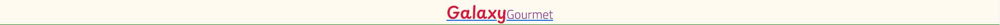
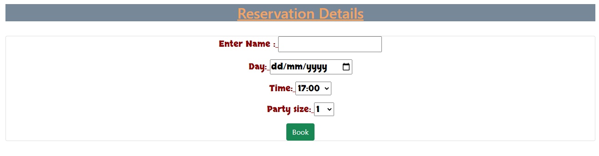
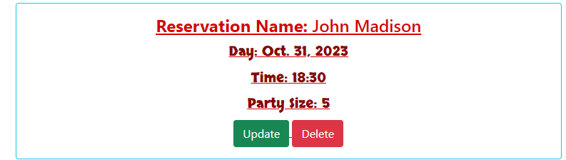
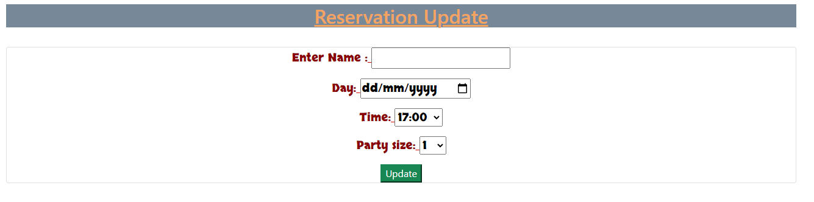
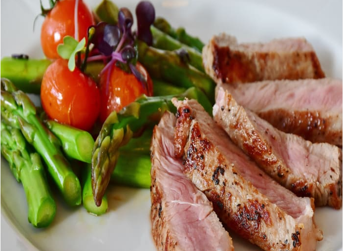
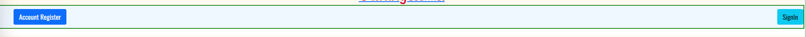
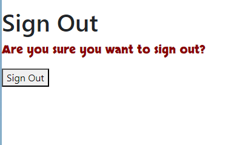
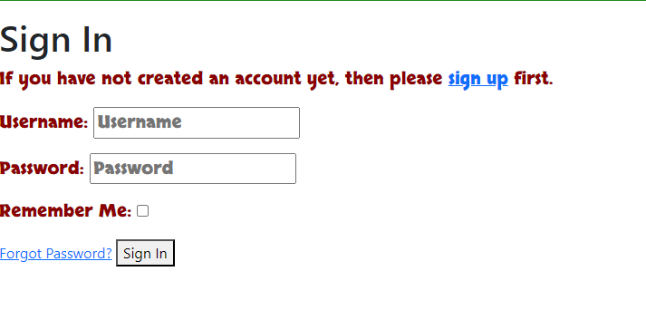
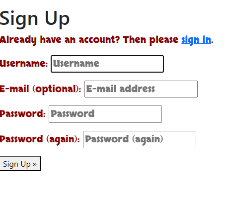

# Galaxy Gourmet Website 
The Galaxy Gourmet site offers users a chance book a table at a family friendly restaurant, where the whole family can relax and enjoy succulent meals.
The restaurant allows users to create an account so that they may see their own reservations to update or remove if needed.
It also offers a menu and times for booking along with socila media accounts to floow to stay updo fate with the restaurant.
There are variou fonts used to make the website feel less bland. They are Oswald,Playpen Sans, Skranji, Titillium Web 300 and also sans-serifs as a back up font.

# -Features-

  #### Favicon:

  - Favicon is dispalyed on the tab with the title of the page.

 -  

  #### Title:

  - The title is also a link that will bring the user back to see the menu.

 -

#### Menu Title:

 - A title showing users where the menu is.
  
 -  

 #### Menu:
  
  - The menu shows what types of foods and drinks are avaiable.

 -
 -

#### Time:
  
   - Times that aravaible to book are shown under the menu.
  
  -

#### Social Media:
  
  - The social media profiles are placed at the bottom of the page for users to click.
  
 -

 #### Creating a reservation:
  
  - Form to create a reservation.

  -

#### Reservations:

 - Reservations are all shown on this page to be view updated and deleted.
  
  -

#### Updating a reservation:
  
 - Form to update users reservation and success message. Images are placed at the bottom on the page to entice the user in placing an reservation to try the food.

  -
  -
  -
  -

#### Deleting Reservations:

 - Reservations are removed once the delete button is pressed with a confirmation message
  
  -

#### Account Creation and sign in bar:
  
   - Allows new and existing users to make an account or sign in to one the already have.

  -

#### Sign Out:

  - Users have the ablity to sign out of thier account, with a success message.
  
  -
  -

#### Sign In:
  
  - Page allows users to sign in with their details with a success message.

  -
  -

#### Sign Up page:

 - Page allows users to make an account.
  
  -
  

# -Technologies used-

- HTML
- CSS
- Bootstrap
- JavaScript
- Python
- Postgresql  
- Cloudinary
- Django allauth library
- Django
- Gunicorn
- Elephantsql
- Google fonts

# -Testing-
-Testing can be found on this page:[TESTING.md](TESTING.md)

# -Bugs -

    - The sign in/ out and Account Creation page wouldnt style when css was applied.
    - Images on the Reservaiuon details page are not in wouldnt form correctly.

# -Deployment-
    Deploying on Heroku:

- Create an account on Herku
- Click on a new app.
- In the settings, got to the Config Vars.
- In the Config Vars, add the Enviroment Variables.
- Go to the Deploy tab and select Github to connect to.
- Search for the Repository required and select once found.
- Choose between Automatic or Manual Deploy.
- Once built got to Open App at the top of the page.
- Page will be deployed if successfully built.

## -Web Browser used -

  - Chrome

## -Devices Used -

  - 12th Gen Intel (R) Core TM i7-12700F - Desktop    -

# -Credits-

## Content

  - 'I think before i blog' walkthrough on [CodeInstitute](https://learn.codeinstitute.net/courses/course-v1:CodeInstitute+FST101+2021_T1/courseware/b31493372e764469823578613d11036b/fe4299adcd6743328183aab4e7ec5d13/) 
  - Other students on the Code Insitiute course through the [Slack](https://slack.com/intl/en-gb/get-started#/createnew) website.
  - Tutors on Tutor Assistance[CodeInstitue](https://learn.codeinstitute.net/ci_support/diplomainfullstacksoftwarecommoncurriculum/tutor)

## -Media-

  - Images from [Pexels](https://www.pexels.com/)