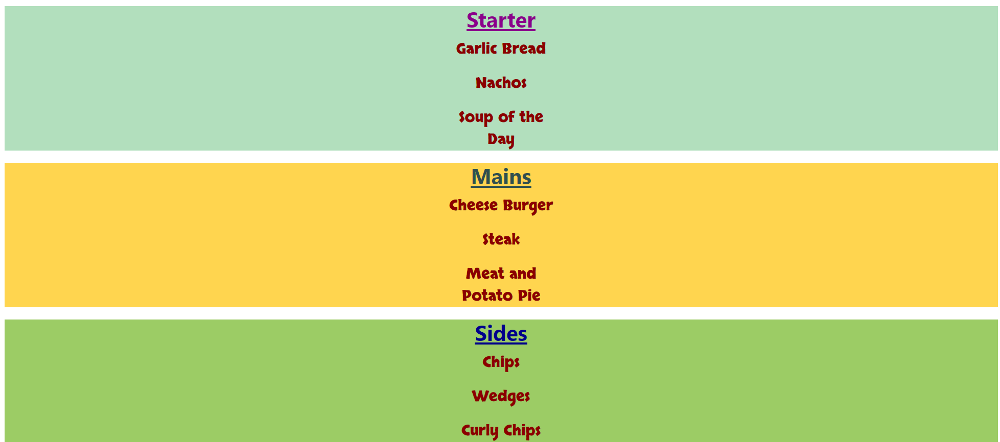
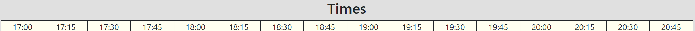
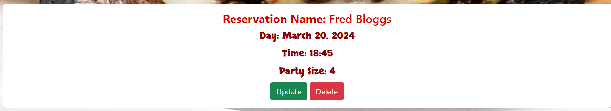
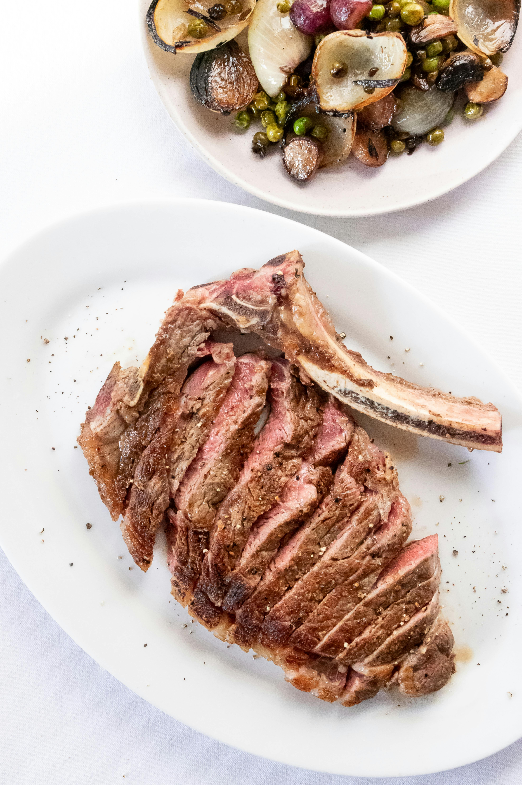

# Galaxy Gourmet Website 
The Galaxy Gourmet site offers users a chance book a table at a family friendly restaurant, where the whole family can relax and enjoy succulent meals.
The restaurant allows users to create an account so that they may see their own reservations to update or remove if needed.
It also offers a menu and times for booking along with socila media accounts to follow to stay upto date with the restaurant.
There are various fonts used to make the website feel less bland. They are Oswald,Playpen Sans, Skranji, Titillium Web 300 and also sans-serifs as a back up font.

# -Features-

  #### Favicon:

  - Favicon is dispalyed on the tab with the title of the page.

   

  #### Title:

  - The title is also a link that will bring the user back to see the menu.

 

 

 ### Welcome Message:
 - A welcome message is shown to the users that tells the users what information is.

 

#### Menu Title:

 - A title showing users where the menu is.
  
   

 #### Menu:
  
  - The menu shows what types of foods and drinks are avaiable.

 
 

#### Time:
  
   - Times that are available to book are shown under the menu.
  
  

#### Social Media:
  
  - The social media profiles are placed at the bottom of the page for users to click.
  
 

 #### Creating a reservation:
  
  - Form to create a reservation.

  

#### Reservations:

 - Reservations are all shown on this page to be view updated and deleted.
  
  

#### Updating a reservation:
  
 - Form to update users reservation and success message. Images are placed at the bottom on the page to entice the user in placing an reservation to try the food.

  
  
  

#### Deleting Reservations:

 - Reservations are removed once the delete button is pressed with a confirmation message.
  
  

#### Account Creation and sign in bar:
  
   - Allows new and existing users to make an account or sign in to one the already have.

  

#### Sign Out:

  - Users have the ablity to sign out of thier account, with a success message.
  
  
  

#### Sign In:
  
  - Page allows users to sign in with their details with a success message.

  
  

#### Sign Up page:

 - Page allows users to make an account.
  
  

#### Images
  
  
  
  
  
    

# -Technologies used-

- HTML
- CSS
- Bootstrap
- JavaScript
- Python
- Postgresql  
- Cloudinary
- Django allauth library
- Django
- Gunicorn
- Elephantsql
- Google fonts

# -Testing-
-Testing can be found on this page:[TESTING.md](TESTING.md)

# -Deployment-
    Deploying on Heroku:

- Create an account on Heroku.
- Click on a new app.
- In the settings, got to the Config Vars.
- In the Config Vars, add the Enviroment Variables.
- Go to the Deploy tab and select Github to connect to.
- Search for the Repository required and select once found.
- Choose between Automatic or Manual Deploy.
- Once built got to Open App at the top of the page.
- Page will be deployed if successfully built.

## -Web Browser used -

  - Chrome

## -Devices Used -

  - 12th Gen Intel (R) Core TM i7-12700F - Desktop

# -Credits-

## Content

  - 'I think before i blog' walkthrough was used as a template to help create the project through [CodeInstitute](https://learn.codeinstitute.net/courses/course-v1:CodeInstitute+FST101+2021_T1/courseware/b31493372e764469823578613d11036b/fe4299adcd6743328183aab4e7ec5d13/). 
  - Other students questions and previous projects on the the same subject such as [Garth McGirr](https://github.com/Gareth-McGirr/Portfolio-Project-4-SizzleAndSteak/blob/main/README.md) & [Ali Okeeffe](https://github.com/AliOKeeffe/PP4_My_Meal_Planner/blob/main/README.md) were used as a guide and further understand on the project creation through [Slack](https://slack.com/intl/en-gb/get-started#/createnew).
  - When a problem occured Tutors on Tutor Assistance link was used through [CodeInstitue](https://learn.codeinstitute.net/ci_support/diplomainfullstacksoftwarecommoncurriculum/tutor).
  - An image was placed on the browser tab and was created through [Favicon](https://www.favicon.cc/).
  - To show messages to the user, whe website offered helpful tips on how to show the [Messages](https://docs.djangoproject.com/en/3.2/ref/contrib/messages/#using-messages-in-views-and-templates/).
  - When i came across an error i used [Positonal Arguments](https://stackoverflow.com/questions/68572656/django-missing-1-required-positional-argument-id/).
  - When i struggled and needed to understand the fix i looked at page for [Views](https://stackoverflow.com/questions/26258905/the-view-didnt-return-an-httpresponse-object-it-returned-none-instead/) i also used this link for help on [Views](https://docs.djangoproject.com/en/4.2/ref/class-based-views/base/#django.views.generic.base.View/).
  - When it came to view forms as a paragraph and understand the process better i used the link on [Paragraph](https://www.geeksforgeeks.org/form-as_p-render-django-forms-as-paragraph/).
  - I got a error message and to solve the issue i used the link for [NoReverseMatchError](https://stackoverflow.com/questions/38390177/what-is-a-noreversematch-error-and-how-do-i-fix-it/).
  - When i was stuck on the understanding on the usage of was used i looked into [allauth](https://docs.allauth.org/en/latest/).
  - Understanding the styling  of my project was used with [Grid](https://materializecss.com/grid.html/) and when the colors were need i used both a bootstrap site for their tips on [Colors](https://getbootstrap.com/docs/5.0/utilities/colors/) &  i also used this site for their helpful tips on [Color](https://materializecss.com/color.html/).
  - When it came to creating a form for my project i used 2 different links. The first was this link on how to craft a [Form](https://docs.djangoproject.com/en/4.2/topics/forms/), and the second was a video on [YouTube](https://www.youtube.com/watch?v=ncradqkSzCw/).
  - Trying to add a function to stop users selecting previous dates i reached out for help from [Tutors](https://learn.codeinstitute.net/ci_support/diplomainsoftwaredevelopmentpredictiveanalytics/tutor). I also used links to gain understanding on the issue, the first being from [Avoidence of past date booking](https://stackoverflow.com/questions/70671189/avoid-booking-past-dates-with-django), the second on creating a [Date picker](https://stackoverflow.com/questions/74227268/how-to-make-a-date-picker-that-does-not-select-previous-dates-in-django) and finally how to prevent the DateField picking [Previous dates](https://stackoverflow.com/questions/15751976/how-to-prevent-datefield-record-addition-for-past-days-in-django).
  - I came across a problem that had a dropdown menu, showing all the Users, i wanted to hide this being shown so i asked for help from a [Tutor](https://learn.codeinstitute.net/ci_support/diplomainsoftwaredevelopmentpredictiveanalytics/tutor) which they pointed me towards the blog [Walkthrough](https://github.com/Code-Institute-Solutions/blog/blob/main/14_where_to_put_things/03_tidy_up/blog/views.py).

## -Media-

  - Images for the background of the pages were taken and used from [Pexels](https://www.pexels.com/)