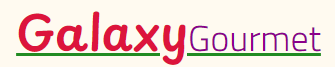
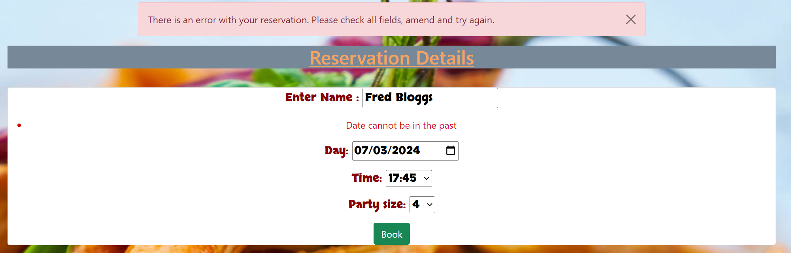

# TESTING

---

## Manual Testing

- Hover action:

When the User hovers over buttons and links the colors changes so the User can see that it is active.

 

 

 

 

 

 

 

 
 

---

- Messages:

Messages are shown to the User when an action is either successful or blocked.

 

 

 

 

 

 

 

 

 

---

- Reservation Selectors:

After every User interaction an message is displayed on the success of the action (as can be seen in the Manual Testing section)

---

- Incorrect Login:

After making the reservation it is the only one shown to the logged in User.

---

- Reverted to Login page:

When creating the reservation the form only asks the User for the Name to be on the reservation and not any of the Users 'Username' aswell to keep names protected.

---

---

## Site Responsiveness

---

## Code Validation

### HTML
base.html - [Errors](media/images/pp4_base.html_validation.png)

index.html -[Errors](media/images/pp4_index.html_validation.png)

create_reservation.html - [Errors](media/images/pp4_create_reservation.html_validation.png)

bookings.html -[Errors](media/images/pp4_bookings.html_validation.png)

update_booking.html - [Errors](media/images/pp4_update_reservation.html_validation.png)

logout.html - [Errors](media/images/pp4_logout.html_validation.png)

login.html -[Errors](media/images/pp4_login.html_validation.png)

### Python

Admin.py - [Errors](media/images/pp4_css_admin.py_validation.png)

Forms.py - [Errors](media/images/pp4_css_forms.py_validation.png)

Apps.py - [Errors](media/images/pp4_css_apps.py_validation.png)

Models.py - [Errors](media/images/pp4_css_models.py_validation.png)

Views.py - [Errors](media/images/pp4_css_views.py_validation.png)

Urls.py - [Errors](media/images/pp4_css_urls.py_validation.png)

### CSS

style.css - [Errors](media/images/pp4_css_validation.png)

---

## Testing User Stories

- The images for the User Stories can be found in both the Features section of the README.md and above in the manual testing.

---

- Menu:

The menu was made to be vibraant and noticable by the users and was presented with many options to choose.

---

- Site Navigation:

The nav bar was created and offered up all the options:
 ..* Sign in
 ..* Log Out
 ..* Account Creation
 ..* Ability to Book
 ..* See your reservations
 When each button is clicked it takes the user to the appropriate page.

 ---

- Account Sign-Up:

The account page offers users fields to place their Username, Email and both Password and Password Verification. Once completed it passes the Users to the page with the ability to Book a reservation, View Details and Sign Out.

---

- Making A Reservation:

Clicking the Book button takes the User to the Reservation for, which offers users fields for the Name, Date, Time and Party Size. Once completed it will go through to the page to view the reservation and its details.

---

- Update Reservations:

On the reservation details it shows an green 'Update' button, when pressed takes the user back to the creation page and allows them to create a new reservation and once completed deletes the old reservation and places the new one in its place.

---

- Delete Reservations:

The red 'Delete' button is placed next to the 'Update' and when clicked it deletes the reservation altogether.

---

- Confirmation Message:

After every User interaction an message is displayed on the success of the action (as can be seen in the Manual Testing section)

---

- Only Users Reservations Show Up:

After making the reservation it is the only one shown to the logged in User.

---

- Dropdown Menu of Users Names Hidden From The Reservation Form:

When creating the reservation the form only asks the User for the Name to be on the reservation and not any of the Users 'Username' aswell to keep names protected.

---

- Stop Users From Selecting Previous Dates:

When Users select a date that isnt on the present day of access or in the future then an error appears and teels the User to correct the mistake.

---

- Sign In:

When the User clicks the 'Sign In' the are taken to a page with a form asking for their 'Username' and 'Password', there is a button the that asks to be rememeberd for Users easment and help for if/when they return again. There is also a link for forgotten passwords the User can click if they forgot the details.

---

- Sign Out:

When the User clicks on the 'Sign Out' button they are taken to a page to clarify that they want to Sign Out, once clarified they are then taken to the beginning page the sign in and create an account with a message confirming the successful action.

---

- Block Users From Accessing Site Witout Signing In:

When a User who is not a registered member or logged in tries to access functions through the URL, they are sent to the login page. 

## Bugs Encountered and Resolutions

---

## Open Bugs